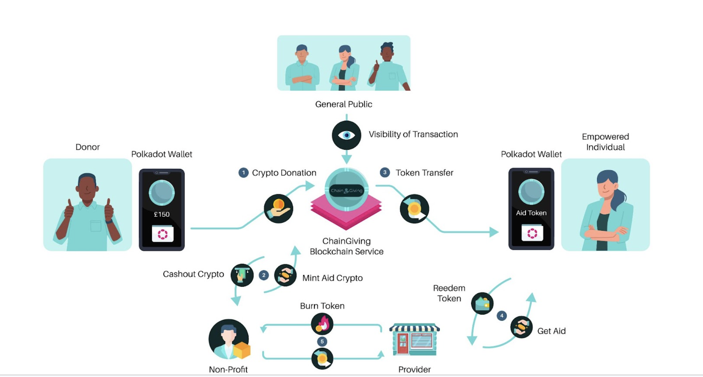
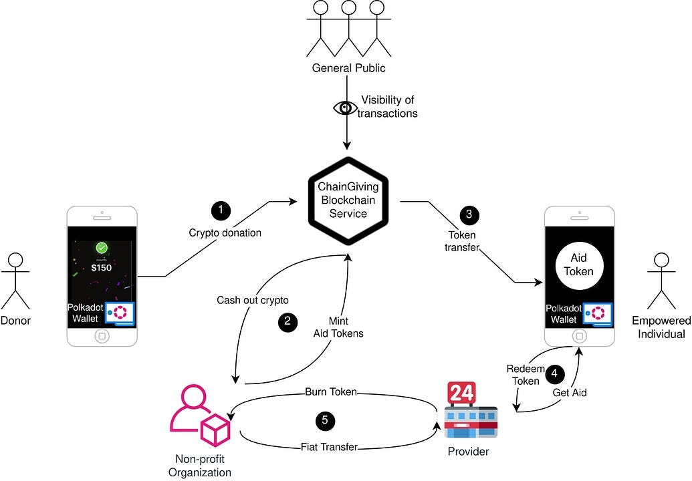

 ![][image1]

#  Chain Giving Whitepaper

# On–Chain Operations and Fundraising for Non Profit

# Version 1.0 March, 2026

# Version 0.2 January, 2025

# Fundraising and Transparent donations on the Blockchain.

## Version 0.1 June, 2024

[**Mission Statement	2**](#mission-statement)

1.1 [CG: More Truthful Giving for Everyone.	2](#cg:-more-truthful-giving-for-everyone.)

1.2 [Project overview	3](#project-overview)

[**Why Do We Need a Blockchain for Digital Humanitarian Assistance?	5**](#why-do-we-need-a-blockchain-for-digital-humanitarian-assistance?)

[**A Public Blockchain Designed for Humanitarian Activities	7**](#a-public-blockchain-designed-for-humanitarian-activities)

[**Technical Specifications	8**](#technical-specifications)

4.1 [Distribution	9](#distribution)

4.2 [Crowdfunding	9](#crowdfunding)

4.3 [Program	11](#program)

4.4 [User Interfaces	11](#user-interfaces)

# **Mission Statement**  {#mission-statement}

## CG: More Truthful Giving for Everyone. {#cg:-more-truthful-giving-for-everyone.}

The act of giving is one of the most significant expressions of humanity's inherent desire to do good and assist one another. This drives our vision of a world where individuals can not only give freely across borders but also transparently see the impact of their contributions on communities, empowering those who are most in need.

Blockchain technology holds the promise of transforming our approach to philanthropy, aid and donations. This transformation involves moving away from relying solely on blind trust in third parties towards a system underpinned by the provable evidence and accountability that decentralised, permissionless ledgers can provide. More truthful giving, means to create a world where you are no longer second-guessing which NPO to support, or trusting others to know which NPOs (non profit organisations) are on the ground during a crisis or trustworthy. All donations through will be underpinned by transparent technology. 

Although [2023 saw an estimated $2 billion in cryptocurrency donations](https://thenonprofittimes.com/npt_articles/crypto-donations-top-estimated-2-billion-2/), many Non Profit Organizations (NPOs) hesitate to adopt public blockchain solutions due to concerns surrounding scalability, costs, privacy, and the  blurred perception of cryptocurrencies. 

However, we offer a viable solution by introducing a fully public and open blockchain specifically designed to  improve the efficiency of NPOs in raising funds and delivering aid. Subsequently, the open blockchain will build on and improve relationships between donors, recipients and the NPOs that facilitate the aid. The CG public blockchain will then have the power to facilitate numerous experimental aid projects within its ecosystem.  

## 

## Project overview {#project-overview}

[Chain.Giving](https://chain.giving) is a public blockchain initiative tailored to equip NPOs (non profit organisations) with the tools needed to efficiently deliver Digital Humanitarian Assistance. It will provide a comprehensive platform for everyone involved:

* For Donors: Offers _trustless_ and _permissionless_ giving.  
* For NPOs: Equip them with effective and powerful tools to organise the provision of any kind of assistance whether it is financial (eg. Cash and Voucher Assistance) or in kind by providing goods and services in the field.  
* For individuals: Empower them to receive help faster  
* For watchers: Enables anyone to audit money raised and tokens distributed on the public blockchain.

* *Trustless* in the context of trustless giving, refers to providing explicit on-chain evidence to verify an NPO’s transactions. Trust is no longer needed when data is provided.

# Why do we need a Blockchain for Digital Humanitarian Assistance? {#why-do-we-need-a-blockchain-for-digital-humanitarian-assistance?}

In 2022, Cash and Voucher Assistance (CVA) totaling approximately [$10 billion was distributed globally](https://www.calpnetwork.org/web-read/the-state-of-the-worlds-cash-2023-chapter-2-cva-volume-and-growth/)  sharing the significance of digital monetary aid. NPOs increasingly recognise the effectiveness of this mode of assistance over traditional in-kind distributions. Moreover, this aid is increasingly delivered via digital methods, such as mobile wallets. This shift presents a remarkable opportunity to increase the [scale and expand the reach of global humanitarian assistance.](https://www.charities.org/news/cryptocurrency-donations-are-rise-bitcoins-price-continues-surge/)

However, despite digital monetary assistance being proven to be highly effective in delivering aid to those in need, it faces several challenges:

1. Regulatory complexity: Implementing digital aid solutions across international borders is hindered by regulatory challenges. Smaller organisations often struggle with compliance issues and legal barriers, highlighting the need for standardised frameworks to facilitate cross-border aid distribution.  
2. Technological infrastructure and skills: Smaller organisations often lack the technological infrastructure and expertise to deploy digital aid solutions effectively. Capacity-building initiatives are essential to empower organisations with the necessary skills to leverage technology for efficient aid distribution.   
3. Data security and privacy: Data security and privacy are paramount in digital aid distribution, especially in regions with inadequate regulatory oversight. Blockchain’s cryptographic features can mitigate risks and ensure the integrity of sensitive information, enhancing overall data security in aid operations.   
4. Financial inclusion and accessibility: A significant portion of the global population remains unbanked or documented limiting their access to digital aid especially thus in need of aid. Blockchain technology can provide secure decentralised solutions to promote financial inclusion and enable broader participation in aid programs.    
5. Transparency and accountability: Ensuring transparency in aid distribution is critical. Our public ledger enhances accountability, allowing donors to track their contribution in real-time. This transparency helps ensure that aid reaches intended recipients efficiently and fosters trust among donors. 

**Blockchain technologies can offer solutions to these issues, as evidenced by a number of blockchain-based aid programs deployed by leading humanitarian organisations:**

* The World Food Program's [Building Blocks project](https://innovation.wfp.org/project/building-blocks), initiated in 2017, represents one of the pioneering and largest-scale deployments in the humanitarian blockchain industry, with our team at Parity Technologies playing a pivotal role as the blockchain technology provider.Today it boasts supporting 4 million refugees monthly, $3.5m saved in bank fees and over $325m in donations supported since it began.   
* The [Unblocked Cash Project](https://www.oxfam.org/en/unblocked-cash-project-using-blockchain-technology-revolutionize-humanitarian-aid), developed by Consensys for Oxfam in 2019 shares a 96% reduction in delivery time, 75% cost reduction in distribution and $2m in aid distributed digitally  
* The [Humanitarian Token Solution](https://blogs.icrc.org/inspired/2023/06/27/humanitarian-token-solution-digital-cash-assistance-preserves-privacy/) from the International Committee of the Red Cross (ICRC), developed by Partisia Blockchain in 2023\.

So far, those solutions have been limited to larger organisations and still have a long way to reach large scale adoption. **We have identified the opportunity to offer an open and decentralised solution: a public Humanitarian Blockchain accessible to organisations of all sizes.**

# A public blockchain designed for Humanitarian activities {#a-public-blockchain-designed-for-humanitarian-activities}

[ChainGiving](https://chain.giving) (CG) is a public blockchain initiative designed to provide a comprehensive toolkit for Non-Profit Organisations (NPOs) to deliver Digital Humanitarian Assistance. At its launch, the platform will feature two primary functions: a crowdfunding module and an aid token distribution module.

* **The crowdfunding module** enables NPOs to raise funds through cryptocurrency donations, allowing them to receive contributions from around the world while eliminating delays and costs associated with traditional money transfers.  
* **The aid token distribution module** empowers NPOs to create assistance programs using digital tokens. This feature provides NPOs with the tools to generate their own tailor-made fungible or non-fungible tokens to create anything from digital vouchers to proofs of participation.

Crucially, by conducting both crowdfunding and aid distribution on the same blockchain, [ChainGiving](https://chain.giving) can closely link these two aspects. This ensures that donor funds for a specific program are directly tied to the corresponding aid delivery. It also enhances transparency for donors and the public, while expediting the delivery of aid.

To explain the different user journeys and the flow of actions within the [ChainGiving](https://chain.giving) platform, we propose the following diagram which is decomposed in five distinct steps.

1. A donor equipped with their cryptocurrency wallet can contribute to various crowdfunding programs established by NPOs on the platform. Each program sets a donation target and specifies the recipients of "Aid tokens". These tokens, issued by the NPO, represent entitlements to goods or services.  
2. When the donation target is reached, the NPO initiates the minting (creation) of these tokens and transfers the donated cryptocurrency to their wallet. This process occurs simultaneously and transparently, visible to all.  
3. Upon receipt, end-users find aid tokens in their wallets. These tokens could be fungible (like a food voucher) or non-fungible (evidence of program participation) and are immediately usable. The transparency of blockchain transactions allows the public to track this activity in real-time.  
4. End-users can then visit a participating provider (e.g., a local supermarket collaborating with the NPO) and redeem their tokens in exchange for the program’s goods or services using the Chain.Giving mobile wallet.  
5. Periodically, local aid providers trigger the burning (destruction) of program tokens and receive fiat currency from the NPO.

# Technical specifications {#technical-specifications}

## Distribution {#distribution}

A distribution is defined as: a list of target accounts along with the set of fungible or non-fungible custom tokens that will be allocated to each account.

Each distribution owns a distribution account. This account safeguards the tokens until they are allocated. A distribution progresses through three states:

1. INACTIVE: The distribution is proposed but awaits the fulfilment of other conditions for activation.  
2. READY: The distribution is marked as ready by the owner, indicating that all tokens have been minted to the distribution account.  
3. DISTRIBUTED: This state is reached after the transfer of tokens to the specified list of beneficiary accounts.

A distribution can be initiated either manually by the owner or automatically at a scheduled date.  
The distribution module alone is fully capable of conducting an on-chain distribution of assets. Typically, existing aid token platforms implement only this functionality.  
However, relying solely on the distribution module means depending on a centralised entity for the collection of donations off-chain in order to provide the funding required to pay providers for the goods and services redeemed for tokens. Consequently, users have no way to independently verify that funds have been properly collected and allocated for the intended purposes.

## Crowdfunding {#crowdfunding}

A crowdfunding is defined by: 

* a target amount of tokens (e.g., 1000 DOT)  
* a start and end date  
* a description  
* a completion condition (either wait\_until\_funded or wait\_until\_end\_date).  
* an owner account with a valid Chain.Giving NPO identity, vetted by governance

Crowdfundings are linked to a “stash account” which safeguards the funds until the crowdfunding period ends. These funds cannot be directly accessed by the owner. There are three states in which a crowdfunding can exist:

* UNFUNDED: Immediately after initiation, signalling that tokens need to be transferred to the distribution account to reach the target  
* FUNDED: Once a sufficient amount of tokens has been collected in the distribution account, indicating readiness for withdrawal.  
* WITHDRAWN: By default, the entire amount can be withdrawn by the crowdfunding owner upon meeting the target funding. Criteria can be established to allow the owner to withdraw funds either in one go or progressively over time.

Crowdfunding offers the following functionalities:

* contributeFunds: Enables donors to transfer tokens towards the crowdfunding goals.  
* cancelContributeFunds: Allows donors to cancel their contribution as long as the crowdfunding is ongoing.  
* cancelCrowdfunding: Can be activated manually by the owner or automatically if the target token amount is not reached by the completion condition. This action triggers the refund to all donors.

This module is crucial for collecting funding transparently on-chain, yet it does not inherently connect to distributions. This is why the introduction of a third module is necessary.

## Program {#program}

A program is defined as a mapping of zero or one crowdfunding and one or several distributions. Programs enable the simultaneous enforcement of crowdfunding withdrawals and the execution of non-cancellable scheduled distributions.  
A specific program "owns" both the crowdfunding and distribution components, enforcing predefined rules. For instance, it is possible to stipulate that the proposed distribution schedule cannot be altered once the crowdfunding begins.  
Although it is optional for programs to have a crowdfunding component, having a program without crowdfunding can still be useful to tie in several distributions together and enforce specific rules (as the distribution will then be owned by the program and not a user account).

Programs offers the following functionalities:

* createProgramDistribution: initialise a new distribution as part of the current program  
* setProgramCrowdfunding: initialise a crowdfunding for the the program allow with completion conditions that will simultaneously trigger the crowdfunding withdrawal and the distributions token transfers  
* cancelProgram: cancel all crowdfunding and distributions of this program and refund donated funds.

## Ethereum Smart contracts

Chain.Giving is developed as a set of Ethereum smart contracts.
See [Smart Contracts](tech-specs/cg-smart-contracts-1.0.md)/

## User Interfaces {#user-interfaces}

To make the chain-giving blockchain usable to conduct aid programs, the following user facing applications (front-end) have to be developed:

* Donor Portal: A simple interface that lets donors browse and contribute to aid programs on the chain.giving blockchain.  
* NonProfit BackOffice: Allow NPOs to create programs by specifying the associated crowdfundings and distributions. It also lets them manage the lifecycle of their programs until completion  
* User wallet: Allows users to view their tokens and redeem them for goods and services at physical and online locations.  
* Blockchain Data Explorer: Based on an index of blockchain data, allows anyone to monitor current and past program executions, including viewing live updates on token redemptions.

See [Frontend](./tech-specs/cg-frontend.md)/

## Gas Sponsoring {#gas-sponsoring}

See [Gas Sponsoring](./tech-specs/cg-gas-sponsoring.md)/

